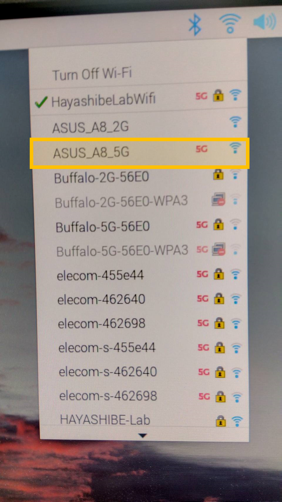
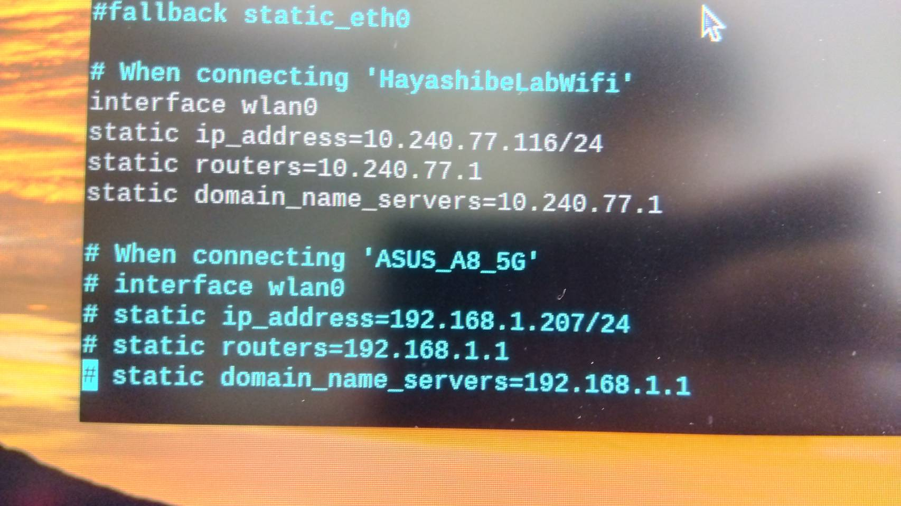

# ルータを介した接続
ラズパイと制御用PCをルータに接続することで, wifiがないような場所でもロボットを動かすことができる.  
ここでは, ラズパイをルータに接続するときの設定方法について説明する(主にIPアドレスの設定方法).

## 準備するもの
- ルータ
- ラズパイ
- モニター (ラズパイ用)
- キーボード (ラズパイ用)
- マウス (ラズパイ用)
- PC

## 流れ
以下の流れで設定する

1. ルータの準備
2. ラズパイのルータへの接続と設定
3. PCのルータへの接続とプログラム内IPアドレスの書き換え

### 1. ルータの準備
ルータは電源挿して, 後ろの電源ボタンを押せば電源がつく.  
少し待って, 前面の「5GHz」のランプが点いたら, 準備完了.

### 2. ラズパイのルータへの接続&設定
この設定では, 基本的にはラズパイの中から設定をいじる必要がある.  
そのため, まずはラズパイにつなぐ用のモニター・キーボード・マウスを用意してラズパイに接続する.

#### ルータへの接続
デスクトップの右上の方のWifiアイコンから, ルータのSSIDを選択して接続する.  
ルータのSSIDは`ASUS_A8_5G`.  
※2Gの方と間違えないように注意  
ここで, しばらく待ってもルータのSSIDが一覧に表示されないときは, ルータのリセットボタンを長押ししましょう (電源ボタンの隣にある).

#### configファイルの編集
いま, ラズパイはIPアドレスを固定することで, 一定のIPアドレスでプログラムからラズパイにアクセスできるようにしている.  
ただ, Wifiの接続先を変える(例えばHayashibeLabWifiからASUS_A8_5Gに変える)と, 固定したIPアドレスとWifiの接続先が噛み合わなくなってしまう.  
そのため, configファイルから固定IPアドレスの設定を書き換える必要がある.  

##### 手順
1. configファイルを開く  
   ターミナル上で`vim /etc/dhcpcd.conf`を入力する  
   ~~~bash
   vim /etc/dhcpcd.conf
   ~~~
   これは, `vim`エディタを使って, `/etc/dhcpcd.conf`を編集するためのコマンド.  
   vimの使い方については[こちら](#vim-基本操作).  
1. configファイルの編集  
    ファイルの最下部まで行き以下の2つを行う
    - `When connecting 'HayahiabeLabWifi'`の下4行をコメントアウト (行頭に#つける)
    - `When connecting 'ASUS_A8_5G'`の下4行のコメントを外す (行頭の#を外す)  
    <figure><figcaption>編集前</figcaption></figure>
    <figure><figcaption>編集後</figcaption></figure>
1. networkシステムの再起動  
   ターミナル上で`sudo systemctl restart networking`を入力
   ~~~bash
   sudo systemctl restart networking
   ~~~

これで, ラズパイ側の設定の変更と反映が完了.  
このラズパイを`ASUS_A8_5G`に接続したときのIPアドレスが`192.168.1.207`に固定されるようになった.

### 3. PCのルータへの接続とプログラム内IPアドレスの書き換え
次にPC側の設定を行う.

#### PCのルータへの接続
普通にPCのWifiを`ASUS_A8_5G`に切り替える.  
その後, UDP通信を行うプログラムのクライアントIPアドレスを`192.168.1.207`に書き換える.  
書き換えの一例を以下に載せる.  
こうすることで, ラズパイとPCを`ASUS_A8_5G`に接続したときに, PCからラズパイを認識できるようになった.

~~~python
CLIENT="192.168.1.207" #change to new snake robot IP address
~~~

#### 接続確認
やらなくてもいいけど, sshで接続確認もできる.
passwordは`hayashibelab`
~~~bash
ssh pi@192.168.1.207
~~~

## vim 基本操作
vimはターミナル上で使えるファイルエディタ．  
メモ帳で代替できるので, vimを使わないといけないわけではない.  
ただ, OS設定ファイル系とかは`user`や`home`ディレクトリにないため, メモ帳から開くのが結構めんどくさい.  
vimならターミナルから一発で開けるので, 手っ取り早くアクセスして編集ができるため便利.  

### 編集から上書き保存までの流れ  
1. `i`で編集モードに移行
2. 編集
3. `esc`で編集モードの終了
   `:`+`w`+`q`の3つのキーを順番に押して最後に`Enter`  
   これで上書き保存

## 裏技 (個人的なメモなので無視でOK)
wifiを切り替えるたびに, いちいちラズパイに周辺機器を取り付けるのはめんどくさい.  
なので, モニター・キーボードをラズパイに接続することなく, PCからのSHHのみでやる裏技を考えてみた (未検証)
1. SSHからラズパイにアクセス
2. dhcphd.confの書き換え   
   ※ここで`systemctl restart networking`をしない. するとSSH切れちゃう.
3. wifiを切り替え  
   `sudo nmcli --ask device wifi connect 'ASUS_A8_5G' ifname wlan0`で切り替えられると思う (未検証)  
   このときに, 自動的にnetworkのsystemがrestartされる気がする

これで元のSHHは強制的に切られるが, PCをルータに接続すれば, そっから別ネットワークでSHHができる(と思う)