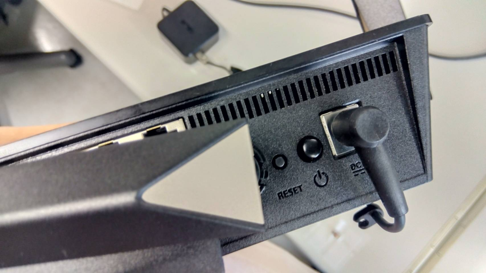
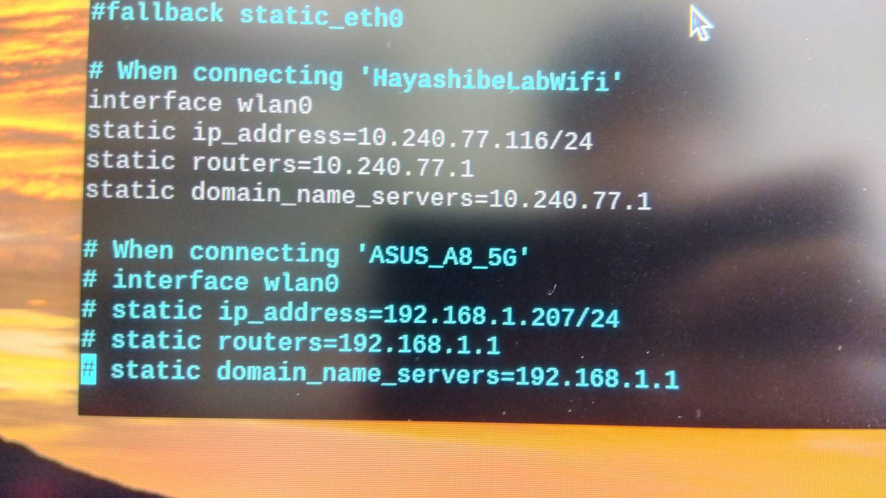
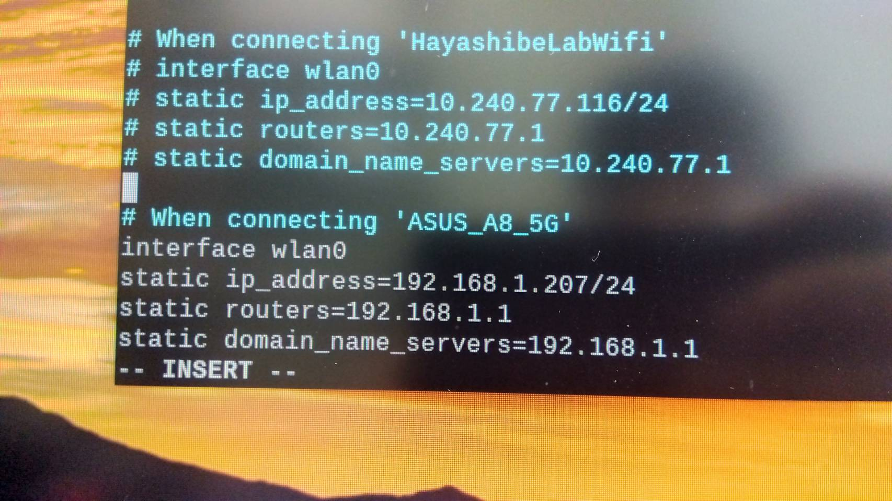

# Connecting via Router
By connecting the Raspberry Pi and the control PC to a router, you can operate the robot even in places without Wi-Fi. This guide explains how to set up the Raspberry Pi to connect to the router (mainly setting the IP address).

## Requirements
- Router
- Raspberry Pi
- Monitor (for Raspberry Pi)
- Keyboard (for Raspberry Pi)
- Mouse (for Raspberry Pi)
- PC

## Steps
Follow these steps to set up:

1. Prepare the router
2. Connect and set up the Raspberry Pi with the router
3. Connect the PC to the router and update the IP address in the program

### 1. Prepare the Router
Plug in the router and press the power button on the back. Wait until the "5GHz" light on the front turns on.

### 2. Connect and Set Up the Raspberry Pi with the Router
You need to configure the Raspberry Pi from within. Connect a monitor, keyboard, and mouse to the Raspberry Pi.

#### Connect to the Router
From the Wi-Fi icon on the top right of the desktop, select the router's SSID `ASUS_A8_5G`. Make sure not to select the 2G one. If the SSID does not appear, press and hold the reset button on the router (next to the power button).

#### Edit the Config File
To access the Raspberry Pi with a fixed IP address, you need to update the config file.

##### Steps
1. Open the config file  
   Enter `vim /etc/dhcpcd.conf` in the terminal. This command uses the `vim` editor to edit the `/etc/dhcpcd.conf` file. For how to use `vim`, see [here](#vim-basic-operations).
   ~~~bash
   vim /etc/dhcpcd.conf
   ~~~
2. Edit the config file  
   Go to the bottom of the file and do the following:
   - Comment out the 4 lines under `When connecting 'HayashibeLabWifi'` (add # at the beginning)
   - Uncomment the 4 lines under `When connecting 'ASUS_A8_5G'` (remove # at the beginning)  
   <figure><figcaption>Before Edit</figcaption></figure>
   <figure><figcaption>After Edit</figcaption></figure>
3. Restart the network system  
   Enter `sudo systemctl restart networking` in the terminal.
   ~~~bash
   sudo systemctl restart networking
   ~~~

Now, the Raspberry Pi is set to have a fixed IP address `192.168.1.207` when connected to `ASUS_A8_5G`.

### 3. Connect the PC to the Router and Update the IP Address in the Program
Next, configure the PC.

#### Connect the PC to the Router
Switch the Wi-Fi to `ASUS_A8_5G`. Then, update the client's IP address in the program to `192.168.1.207`. An example is shown below:

~~~python
CLIENT="192.168.1.207" #change to new snake robot IP address
~~~

#### Connection Check
You can also check the connection via SSH (optional). The password is `hayashibelab`.

~~~bash
ssh pi@192.168.1.207
~~~

## vim Basic Operations
`vim` is a file editor that can be used in the terminal. While you can use Notepad instead, `vim` is convenient for quickly accessing and editing system files that are not in the `user` or `home` directories.

### Steps to Edit and Save
1. Press `i` to enter edit mode
2. Edit the file
3. Press `esc` to exit edit mode
4. Press `:` + `w` + `q` and then `Enter` to save and exit

## Tips (Personal Notes, Ignore if not needed)
To avoid connecting peripherals to the Raspberry Pi every time you switch Wi-Fi, you can try the following (untested):
1. Access the Raspberry Pi via SSH
2. Edit `dhcpcd.conf`  
   Do not run `systemctl restart networking` here, as it will disconnect SSH.
3. Switch Wi-Fi  
   Use `sudo nmcli --ask device wifi connect 'ASUS_A8_5G' ifname wlan0` to switch (untested). This might automatically restart the network system.

The original SSH connection will be forced to close, but you should be able to SSH again from the PC connected to the router.